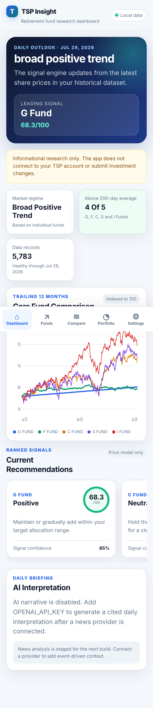

# TSPMaster

A mobile-first Progressive Web App for reviewing historical TSP fund prices, risk metrics, price trends, portfolio behavior, and transparent daily model signals.

The included dataset contains **5,783 dates from May 31, 2003 through July 29, 2026**. The five individual funds have complete histories in the file. Lifecycle fund values begin on their respective inception dates.



## What works in this MVP

- Responsive iPhone-first dashboard with safe-area support and fixed bottom navigation
- Installable web-app manifest and service worker
- Historical price charts for every individual and Lifecycle fund
- Normalized comparison chart for up to five funds
- Returns over 1, 3, 6, and 12 months
- Three-year annualized return
- Annualized volatility
- 50-day and 200-day moving averages
- Current and historical drawdowns
- Deterministic daily fund score and recommendation rationale
- Five-fund portfolio analyzer with historical return, volatility, drawdown, and contribution analysis
- Data-quality endpoint and validation checks
- Optional Google Gemini narrative boundary
- News-provider interface ready for the next phase
- Docker support and automated tests

## Architecture

```text
Browser / iPhone PWA
        |
        v
FastAPI application
  |-- Static responsive web app
  |-- TSP data service
  |-- Quantitative analytics service
  |-- Transparent recommendation engine
  |-- Portfolio analysis service
  |-- Optional AI narrative service
  `-- News-provider boundary
        |
        v
TSP historical CSV
```

This first version intentionally uses a single deployable FastAPI service and a dependency-free browser frontend. That keeps deployment, mobile testing, and maintenance simple. The API contracts are separated so the frontend can later be replaced with Next.js without rewriting the analytics engine.

## Run locally

Python 3.11 or newer is recommended.

```bash
cd TSPMaster
python -m venv .venv

# Windows PowerShell
.venv\Scripts\Activate.ps1

# macOS/Linux
source .venv/bin/activate

pip install -r backend/requirements.txt
cd backend
uvicorn app.main:app --host 0.0.0.0 --port 8000 --reload
```

Open `http://localhost:8000` on the computer.

## Open it on an iPhone

1. Connect the iPhone and development computer to the same network.
2. Start the server with `--host 0.0.0.0` as shown above.
3. Find the computer's local IP address.
4. Open `http://<computer-ip>:8000` in Safari.
5. For a production-quality home-screen installation and offline caching, deploy the application behind HTTPS.
6. In Safari, tap **Share → Add to Home Screen**.

## Docker

```bash
docker compose up --build
```

Then open `http://localhost:8000`.

## Tests

```bash
cd backend
pytest -q
```

The current suite validates:

- Source-file quality
- Core-fund metrics
- Recommendation score boundaries
- Portfolio calculations

## API endpoints

| Endpoint | Purpose |
|---|---|
| `GET /health` | Service and latest-data status |
| `GET /api/v1/dashboard` | Complete mobile dashboard payload |
| `GET /api/v1/funds` | Available individual and Lifecycle funds |
| `GET /api/v1/funds/{id}/history?range=1y` | Fund history |
| `GET /api/v1/funds/{id}/metrics` | Return, trend, volatility, and drawdown metrics |
| `GET /api/v1/compare?funds=g,f,c&range=1y` | Normalized multi-fund comparison |
| `GET /api/v1/recommendations` | Ranked individual-fund signals |
| `POST /api/v1/portfolio/analyze` | Historical allocation analysis |
| `GET /api/v1/data-quality` | Dataset validation report |
| `GET /api/v1/news` | News-provider status and events |

Interactive API documentation is available at `http://localhost:8000/docs`.

## Recommendation model

The model is deterministic. An LLM does not calculate scores.

The current score combines:

- 1-, 3-, 6-, and 12-month momentum
- Position relative to the 50-day moving average
- Position relative to the 200-day moving average
- Recent annualized volatility
- Current drawdown

Every recommendation includes the score, signal confidence, supporting drivers, risks, and methodology. The score currently excludes news so price-based results remain reproducible. News will be added as a separately auditable component.

## Optional AI narrative

Copy `backend/.env.example` to `backend/.env` and set:

```env
GEMINI_API_KEY=your_key_here
GEMINI_MODEL=gemini-2.5-flash
```

The app remains fully functional without an AI key. AI is limited to explaining validated analytics and cannot alter the quantitative calculations or execute account changes.

## Daily job

```bash
cd backend
PYTHONPATH=. python scripts/run_daily.py
```

This writes `backend/data/daily_report.json`. A scheduler such as GitHub Actions, Windows Task Scheduler, cron, Azure Container Apps Jobs, or AWS EventBridge can invoke this command after the data-update process is added.

## Next build phase

1. Add a reliable daily TSP-price update adapter.
2. Connect official economic releases and a licensed market-news source.
3. Deduplicate and classify news events by affected TSP fund.
4. Add walk-forward backtesting and benchmark comparisons.
5. Save user allocation, risk tolerance, and retirement horizon locally or in an authenticated database.
6. Add notifications only when a score crosses a meaningful threshold.
7. Deploy behind HTTPS and add authentication before storing personal portfolio settings.

## Safety boundary

This project is informational decision support, not individualized financial advice. It does not request TSP credentials, connect to a TSP account, or submit interfund transfers or contribution-allocation changes. Historical results do not guarantee future performance.
